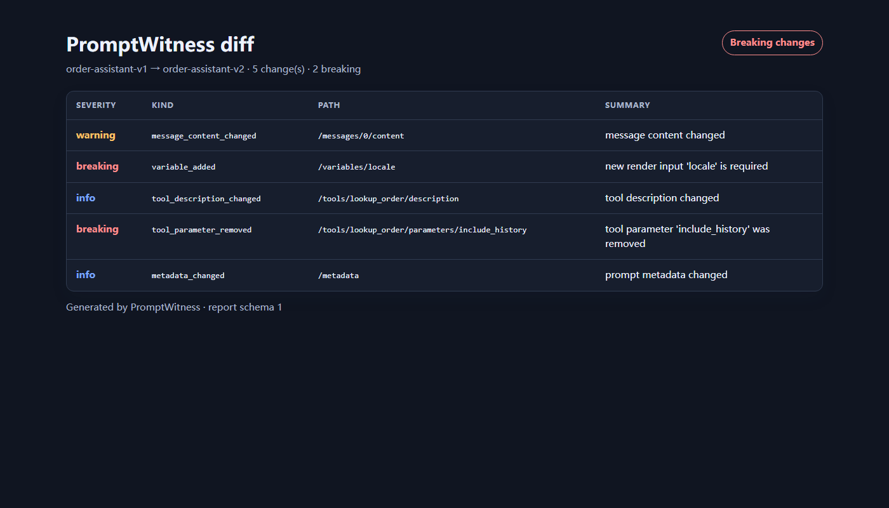
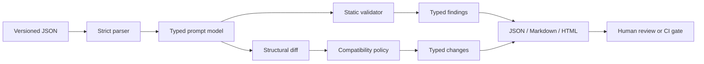

# PromptWitness

PromptWitness makes chat-prompt changes reviewable. It parses a small, versioned
JSON format, validates operational hazards, compares template variables and
tool contracts, and emits deterministic JSON, Markdown, or standalone HTML for
CI and code review.

It does **not** score prompt quality, call an LLM, or claim that a structurally
valid prompt is safe. The narrow goal is to catch changes such as “a new render
variable is now required” or “a tool parameter disappeared” before deployment.

[](https://github.com/appleweiping/promptwitness/actions/workflows/ci.yml)
[](https://www.python.org/)
[](LICENSE)

## What it catches

| Change | Default impact | Why |
|---|---|---|
| New `{{ variable }}` | breaking | Existing render callers do not provide it |
| Removed variable | warning | Callers may still send an unused value |
| Message role/name change or removal | breaking | Conversation structure changed |
| Message content change/addition | warning | Behavior may change, but the render API may not |
| Tool removal or parameter schema change | breaking | The executor contract can no longer match |
| Optional tool parameter addition | info | Existing calls remain representable |
| Required tool parameter addition | breaking | Existing calls become incomplete |
| Metadata or tool-description change | info | No structural invocation change |

The severities are an explicit compatibility policy, not universal truth.
`DiffOptions` lets a caller tighten message-change handling, and the CLI's
`--fail-on` chooses the CI threshold.

## Install

PromptWitness has no runtime dependencies.

Install the latest source from GitHub:

```bash
python -m pip install "git+https://github.com/appleweiping/promptwitness.git"
```

For a source checkout:

```bash
python -m pip install -e ".[dev]"
```

## Sixty-second demo

Validate a prompt, then compare two revisions:

```bash
promptwitness validate examples/before.json
promptwitness diff examples/before.json examples/after.json
```

The diff exits with status `2` because it finds breaking changes and prints:



```text
# PromptWitness diff

`order-assistant-v1` → `order-assistant-v2` · **breaking** · 5 change(s), 2 breaking

| Severity | Kind | Path | Summary |
|---|---|---|---|
| warning | `message_content_changed` | `/messages/0/content` | message content changed |
| breaking | `variable_added` | `/variables/locale` | new render input 'locale' is required |
| info | `tool_description_changed` | `/tools/lookup_order/description` | tool description changed |
| breaking | `tool_parameter_removed` | `/tools/lookup_order/parameters/include_history` | tool parameter 'include_history' was removed |
| info | `metadata_changed` | `/metadata` | prompt metadata changed |
```

Generate a review artifact that opens without a server or CDN:

```bash
promptwitness diff examples/before.json examples/after.json \
  --format html --output promptwitness-report.html --fail-on never
```

## Prompt format

Schema version 1 is intentionally small and portable:

```json
{
  "schema_version": 1,
  "id": "order-assistant-v1",
  "messages": [
    {"role": "system", "content": "Help {{ customer_name }}."},
    {"role": "user", "content": "Check {{ order_id }}."}
  ],
  "tools": [
    {
      "name": "lookup_order",
      "description": "Look up an order.",
      "parameters": {"order_id": {"type": "string"}},
      "required": ["order_id"]
    }
  ],
  "metadata": {"owner": "support"}
}
```

Unknown fields, duplicate object keys, and non-finite JSON numbers are rejected
so misspellings or parser-specific values cannot silently change meaning.
Tool parameter schemas support an intentionally conservative JSON-Schema-like
subset during validation: each parameter is an object with a recognized
`type`, and may include a non-empty `enum`. PromptWitness preserves additional
schema keys for comparison without claiming to implement full JSON Schema.
See [the format reference](docs/prompt-format.md).

## CLI

```text
promptwitness validate PROMPT [--require-system-first] [--allow-empty-content]
                            [--no-secret-scan]
                            [--format json|markdown|html] [--output PATH]
                            [--fail-on never|warning|breaking]

promptwitness diff BEFORE AFTER [--ignore-metadata] [--context-lines N]
                              [--format json|markdown|html] [--output PATH]
                              [--fail-on never|warning|breaking]
```

Exit codes are stable and automation-friendly:

- `0`: the report did not reach the configured threshold;
- `1`: the input or output could not be processed;
- `2`: a valid report reached `--fail-on` (default: `breaking`).

Use JSON for machines, Markdown for pull requests, and HTML for a portable
visual review. All three formats are generated from the same typed report.

## Python API

```python
from promptwitness import DiffOptions, Severity, compare_prompts, load_prompt
from promptwitness.reporting import render_json

before = load_prompt("examples/before.json")
after = load_prompt("examples/after.json")
report = compare_prompts(
    before,
    after,
    DiffOptions(content_change_severity=Severity.BREAKING),
)

print(render_json(report))
if not report.compatible:
    raise SystemExit("prompt contract changed")
```

Template rendering is deliberately literal—there are no expressions, filters,
attribute access, or code execution:

```python
from promptwitness.variables import render_template

rendered = render_template("Hello {{ name }}", {"name": "Ada"})
```

## Architecture



The parser owns format errors; validation owns suspicious-but-parseable
content; diffing owns compatibility semantics; reporting has no policy logic.
Read [the architecture notes](docs/architecture.md) for determinism and trust
boundaries.

## CI example

```yaml
- name: Check prompt compatibility
  run: |
    promptwitness validate prompts/current.json --format json
    promptwitness diff prompts/released.json prompts/current.json \
      --format markdown --output prompt-diff.md
```

If warning-level review is mandatory, add `--fail-on warning`. For report-only
jobs, use `--fail-on never`.

## Security and limitations

- The credential detector is a small local heuristic. It can miss secrets and
  can flag harmless examples; it is not a secret scanner.
- Variable parsing supports only `{{ identifier }}` with letters, digits,
  `_`, `.`, and `-`. It intentionally does not evaluate a template language.
- Messages are compared by position because schema version 1 has no message
  IDs. An insertion can therefore produce a noisy but explicit diff.
- Tool schemas are compared structurally, not resolved through `$ref`, coercion,
  or model-provider extensions.
- Compatibility does not predict model behavior. Evaluation data and human
  review remain necessary.
- HTML output escapes report text and has no external resources, but should
  still be treated as an artifact derived from untrusted input.

Please report vulnerabilities privately using [SECURITY.md](SECURITY.md).

## Development

```bash
ruff check .
ruff format --check .
mypy src
pytest
python -m build
```

The test suite uses branch coverage and enforces a 90% minimum. CI runs on
Python 3.10, 3.11, 3.12, and 3.13.

## Roadmap

- stable message identifiers and alignment strategies in a future schema;
- user-defined compatibility policies loaded from a reviewed config;
- SARIF output for code-scanning interfaces;
- provider adapters kept separate from the dependency-free core.

Contributions are welcome. Start with [CONTRIBUTING.md](CONTRIBUTING.md) and
please include tests for every new compatibility rule.

## License

MIT. See [LICENSE](LICENSE).
